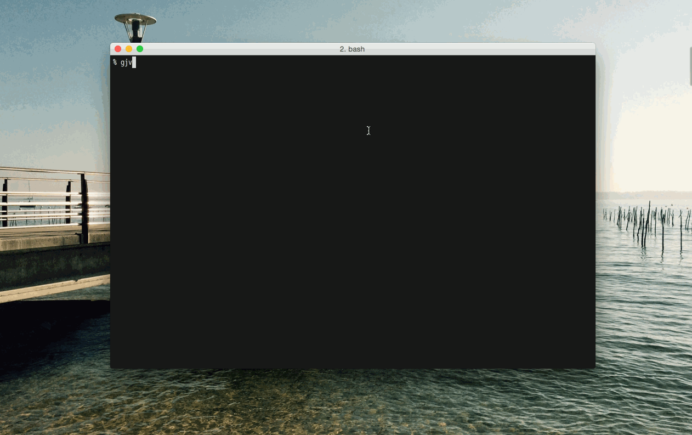
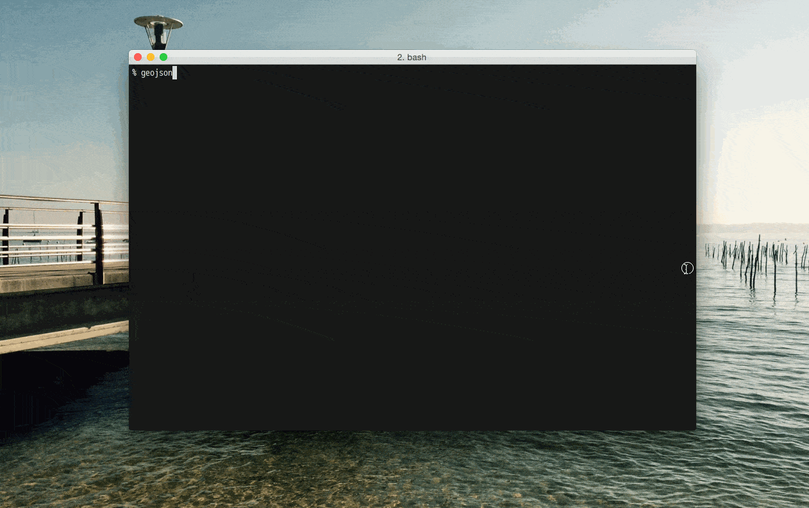

# gjv

A simple cli-driven GeoJSON viewer, motivated by the incredible convenience of
[vmd](https://github.com/yoshuawuyts/vmd).

Built with [electron](http://electron.atom.io/) and [mapbox-gl](https://github.com/mapbox/mapbox-gl-js), and owes much to this prior art: [geojsonapp](https://github.com/mick/geojsonapp).





## Install

```
npm install -g gjv
```

## Usage

```
gjv [FILE]
```

## Dev

```
$ npm install
```

### Run

```
$ npm start
```

### Build

```
$ npm run build
```

Builds the app for OS X, Linux, and Windows, using [electron-packager](https://github.com/maxogden/electron-packager).


## License

MIT © Anand Thakker (http://anand.codes)
